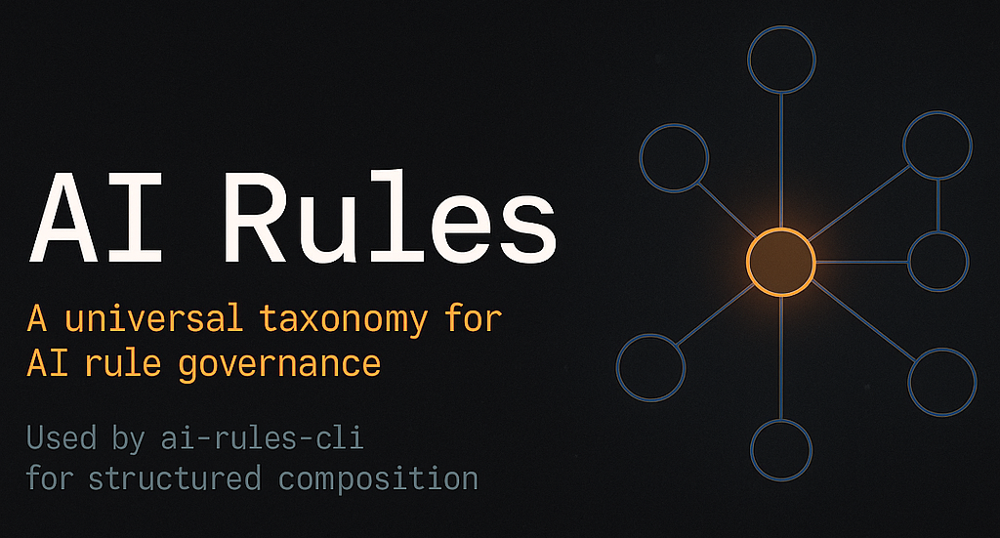

<!-- Banner -->
<p align="center">
  
</p>

<h1 align="center">AI Rules</h1>
<p align="center"><strong>A universal taxonomy for AI rule governance</strong></p>

<p align="center">
  <a href="https://github.com/rerades/ai-rules-cli">Used by ai-rules-cli</a> •
  <a href="#taxonomy">Taxonomy</a> •
  <a href="#metadata-schema-json-schema">Schema</a> •
  <a href="#governance">Governance</a>
</p>

---

## 🧩 Overview

**AI Rules** defines a universal **metamodel and taxonomy** for describing project rules in a structured, machine-readable way.
It is designed to work hand-in-hand with [**ai-rules-cli**](https://github.com/rerades/ai-rules-cli), which consumes these definitions to bootstrap, validate, and evolve project rule sets.

---

## Metamodel Definition

- CLI-guided composition (question tree → rule selection)
- Tag governance (avoiding taxonomic jungle)
- Compatibility/conflicts and requirements between rules
- Audit trail (provenance, "last reviewed", owner)
- Controlled evolution (SemVer + maturity states)

## 🗂️ Taxonomy

Rules are described through fixed facets (enums) and optional tagged fields to ensure predictable composition and filtering.

### Core Facets (Enums)

| Facet         | Values                                                                        |
| ------------- | ----------------------------------------------------------------------------- |
| **Category**  | `code`, `foundation`, `framework`, `security`, `testing`, `architecture`, ... |
| **Scope**     | `global`, `repo`, `package`, `component`, `page`, `api`, `ci`, `cd`           |
| **Language**  | `typescript`, `javascript`, `html`, `css`, `python`, `go`, ...                |
| **Lifecycle** | `advisory`, `recommended`, `enforced`                                         |
| **Maturity**  | `draft`, `beta`, `stable`, `deprecated`                                       |
| **Stability** | `experimental`, `evolving`, `locked`                                          |
| **Audience**  | `frontend`, `backend`, `fullstack`, `a11y`, `sec`, `devops`, `architect`      |
| **Severity**  | `info`, `low`, `medium`, `high`, `critical`                                   |

---

### Relational Fields

```yaml
requires[]   # other rule IDs required
conflicts[]  # incompatible rules
supersedes[] # replaces older rules
bundles[]    # logical groups (baseline/web)
```

---

### Operational Fields

```yaml
files: ["src/**/*.tsx"]
enforcement:
  lint: "warn"
  ci: "allow"
  scaffold: "suggest"
order: 10
inputs:
  optionName:
    type: "boolean"
    default: true
```

---

### Tagged Fields

- `topic:*` → thematic tags (`topic:wcag22`, `topic:core-web-vitals`)
- `lint:*` → linting scope (`lint:eslint-config`)
- `test:*` → testing scope (`test:playwright`)
- `a11y:*`, `perf:*`, `sec:*` → accessibility, performance, security

---

## 🧮 Governance Rules

- New vocab or enum changes require PR review by "Owners".
- Any new enum value → Schema update + changelog entry.
- Consistent rule naming via `domain.subdomain.slug`.

Example IDs:

```
foundation.baseline.web
language.typescript.strict
framework.react.hooks
performance.core-web-vitals
accessibility.wcag22.keyboard
```

---

## 📐 Metadata Schema (JSON Schema)

The rules conform to [JSON Schema 2020-12](https://json-schema.org/draft/2020-12/schema).
Schema file: [`mdc.schema.json`](./mdc.schema.json)

---

## 🧾 Example Rule (Frontmatter)

```yaml
---
id: typescript.conventions.guidelines
title: "TypeScript Conventions Guidelines"
category: language
language: "typescript"
frameworks: ["react", "astro"]
tooling: ["eslint", "prettier"]
maturity: stable
severity: low
enforcement:
  lint: warn
  ci: allow
  scaffold: none
tags: ["topic:typescript", "lint:typescript-eslint"]
owner: "typescript-team@your-org.com"
review: { lastReviewed: "2025-01-20", reviewCycleDays: 90 }
---
```

---

## ⚙️ Integration with ai-rules-cli

The CLI uses the metadata to:

1. **Filter rules** by category, language, frameworks, and tooling
2. **Resolve dependencies** using `requires` and `conflicts` fields
3. **Generate bundles** based on `bundles` field
4. **Apply enforcement** based on `enforcement` settings
5. **Order rules** using the `order` field for proper composition

## 🧑‍💻 Contributing

- PRs welcome — follow the [schema](./mdc.schema.json).
- Each rule must include metadata and tags.
- Review cycle enforced via `review.lastReviewed`.

---

## 🪪 License

MIT © [Rodrigo Erades](https://github.com/rerades)
