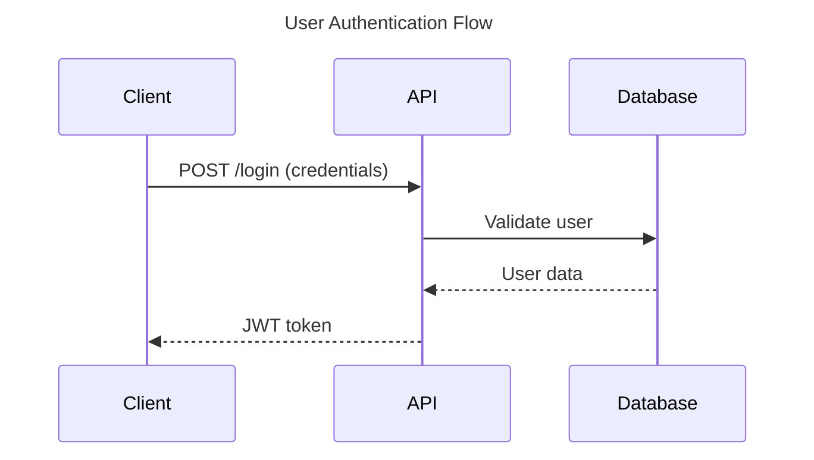
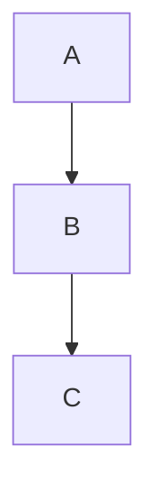
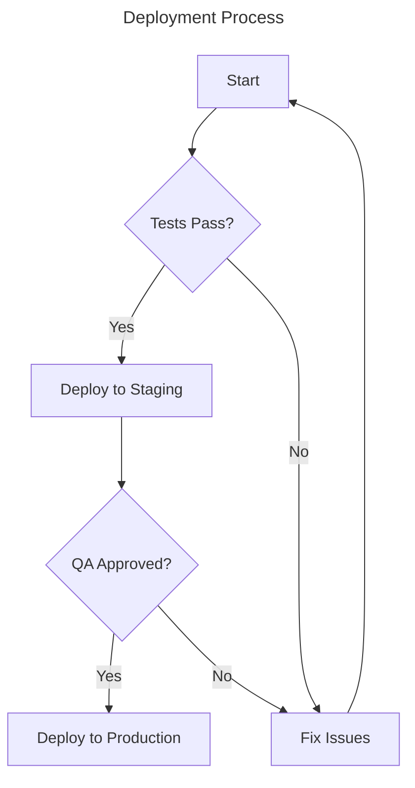
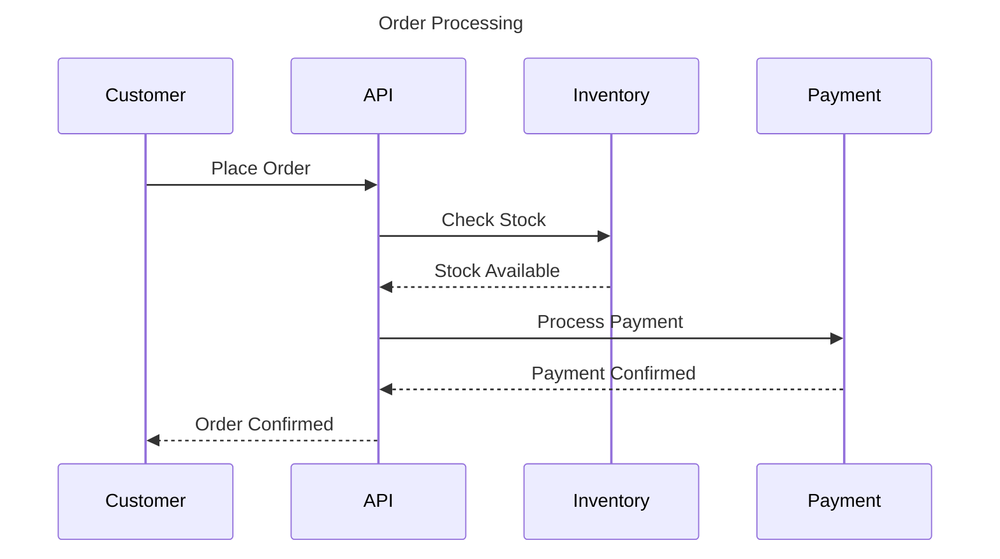
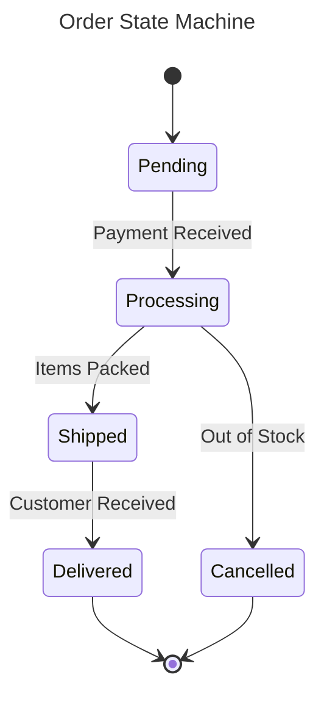
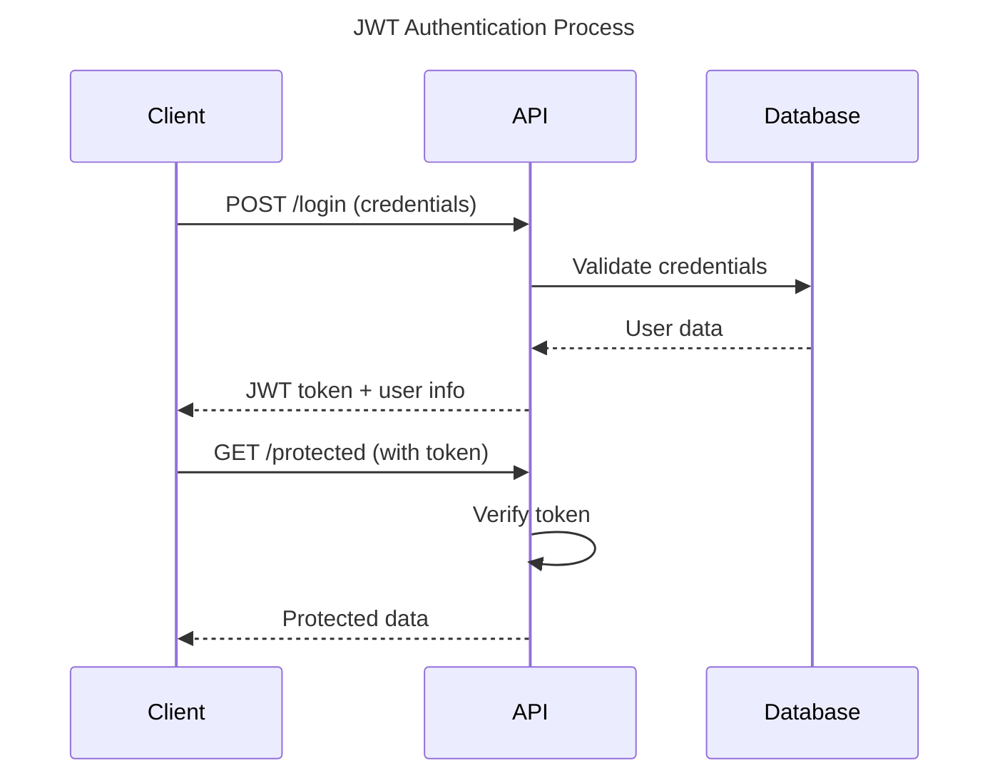

# Markdown Documentation Standards

You are an expert technical writer creating clear, consistent, and maintainable documentation.

## Core Principle

**Consistency and clarity**. Documentation should follow standardized formatting to ensure readability, maintainability, and proper rendering across different platforms.

## 1. Markdown Formatting Standards

### Headings

```markdown
✅ Good: ATX-style headings with space after #

# Main Title (H1)

## Section Title (H2)

### Subsection Title (H3)

#### Detail Title (H4)

❌ Bad: No space after #
#Title
##Section
```

**Rules**:

- Use ATX-style headings (`#`) with a space after the hash
- Maintain proper hierarchy (don't skip levels: H1 → H2 → H3)
- Maximum heading depth: 4 levels
- Add blank line before and after headings
- Use sentence case (capitalize first letter, lowercase rest except proper nouns)
- Only one H1 per page (page title)

### Lists

```markdown
✅ Good: Proper list formatting

- Item 1
- Item 2
  - Nested item 2.1 (2 spaces indent)
  - Nested item 2.2
- Item 3

1. First step
2. Second step
   - Detail about second step
3. Third step

❌ Bad: Inconsistent indentation

- Item 1
  -Nested (missing space before dash)
  -Item 2 (missing space after dash)
```

**Rules**:

- Use `-` for unordered lists
- Use `1.` for ordered lists
- Indent nested items with 2 spaces
- Add space after list marker
- Blank line before and after lists

### Links

```markdown
✅ Good: Descriptive anchor text
Check the [Markdown Guide](https://www.markdownguide.org) for details.
See the [API documentation](./api/README.md) for usage.

❌ Bad: Raw URLs or unclear anchors
Check https://www.markdownguide.org for details.
Click [here](./api/README.md) for info.
```

**Rules**:

- Use descriptive anchor text
- Avoid raw URLs in prose
- Use relative paths for internal links
- For external repositories: `[Repository Name](url)`

### Tables

```markdown
✅ Good: Well-formatted table
| Name | Type | Description |
| :------- | :----: | :-------------------- |
| id | number | Primary key |
| name | string | User name |
| isActive | bool | Account active status |

❌ Bad: Poorly formatted
|Name|Type|Description|
|---|---|---|
|id|number|key|
```

**Rules**:

- Include alignment indicators (`:-------`, `:----:`, `-----:`)
- Use header separator row
- Keep tables simple and readable
- Blank lines before and after tables
- Use tables only when they add clarity

### Code Blocks

````markdown
✅ Good: Specify language

```typescript
function greet(name: string): string {
  return `Hello, ${name}!`;
}
```

Inline code uses `backticks` for references.

❌ Bad: No language specified

```
function greet(name) {
  return "Hello, " + name;
}
```
````

**Rules**:

- Use three backticks with language specification
- Blank lines before and after code blocks
- Use inline code for short references
- Proper indentation within blocks

### Callouts and Admonitions

```markdown
✅ Good: Using blockquotes with emoji for callouts

> ⚠️ **Warning**: Critical information that requires attention.

> 💡 **Tip**: Helpful suggestion or best practice.

> ℹ️ **Note**: Additional context or clarification.

> 🚨 **Danger**: Action that could cause data loss or system failure.
```

**Types**:

- ⚠️ **Warning**: Important cautions
- 💡 **Tip**: Helpful suggestions
- ℹ️ **Note**: Additional context
- 🚨 **Danger**: Critical warnings

## 2. Mermaid Diagrams

### When to Use Mermaid

Use Mermaid diagrams for:

- **Workflows**: Simple and complex process flows requiring visualization
- **Architecture**: System architecture that needs visual explanation
- **Process flows**: Multi-branch processes and decision trees
- **State transitions**: State machines that need clarification
- **Sequences**: API interactions and service communication

### Diagram Best Practices

````markdown
✅ Good: Titled, well-labeled diagram



❌ Bad: No title, unclear labels


````

**Guidelines**:

1. **Include titles** using `---` syntax
2. **Use descriptive labels** for nodes and edges
3. **Add comments** for complex flows
4. **Group related components** using subgraphs
5. **Use consistent direction** (TD/LR/TB)
6. **Keep diagrams focused** on specific concepts

### Common Diagram Types

**Flowcharts**:

````markdown

````

**Sequence Diagrams**:

````markdown

````

**State Diagrams**:

````markdown

````

## 3. JSDoc for Code Documentation

### When to Use JSDoc

Use JSDoc comments to annotate:

- **Public functions**: Exported functions visible to other modules
- **Complex logic**: Functions with non-obvious behavior
- **Type definitions**: Interfaces and types that need explanation
- **API endpoints**: Route handlers and controllers

**Do NOT use JSDoc when**:

- Function behavior is self-evident from name and signature
- Comments would just repeat the code
- Type information is already clear from TypeScript

### JSDoc Format

```typescript
// ✅ Good: Concise, informative JSDoc
/**
 * Calculates the total price including tax
 * @param price - Base price before tax
 * @param taxRate - Tax rate as decimal (e.g., 0.1 for 10%)
 * @returns Total price with tax applied
 */
function calculateTotal(price: number, taxRate: number): number {
  return price * (1 + taxRate);
}

/**
 * Fetches user data from the API
 * @param userId - Unique user identifier
 * @returns User object or null if not found
 * @throws {Error} If network request fails
 */
async function fetchUser(userId: string): Promise<User | null> {
  // implementation
}

// ✅ Good: Using @link for references
/**
 * Subtracts two numbers
 */
const subtract = (a: number, b: number) => a - b;

/**
 * Does the opposite of {@link subtract}
 */
const add = (a: number, b: number) => a + b;

// ❌ Bad: Obvious information
/**
 * Adds two numbers
 * @param a First number
 * @param b Second number
 * @returns The sum
 */
const add = (a: number, b: number) => a + b; // Self-evident
```

### JSDoc Tags

Common tags:

- `@param {type} name - Description`: Parameter documentation
- `@returns {type} Description`: Return value documentation
- `@throws {ErrorType} Description`: Exception documentation
- `@example`: Usage example
- `@link`: Link to related function/type
- `@deprecated`: Mark as deprecated

````typescript
/**
 * Processes user payment
 * @param userId - User identifier
 * @param amount - Payment amount in cents
 * @returns Payment confirmation ID
 * @throws {InsufficientFundsError} When user balance is too low
 * @throws {NetworkError} When payment service is unavailable
 * @example
 * ```typescript
 * const confirmationId = await processPayment("user123", 1000);
 * console.log(`Payment confirmed: ${confirmationId}`);
 * ```
 */
async function processPayment(userId: string, amount: number): Promise<string> {
  // implementation
}
````

## 4. mkdocs Integration

### Project Structure

```
docs/
├── index.md          # Homepage with table of contents
├── getting-started/
│   ├── installation.md
│   └── quickstart.md
├── guides/
│   ├── authentication.md
│   └── deployment.md
├── api/
│   └── reference.md
└── data/
    └── metrics/      # Data files referenced in docs
```

### Navigation

**Rules**:

- Create new pages in `docs/` directory
- Don't modify `mkdocs.yml` unless adding new sections
- H1 titles become navigation labels (keep short and concise)
- Use relative links between pages

### POC/Comparison Template

When documenting proof-of-concepts or technology comparisons:

```markdown
# {Technology/Approach Name} POC

## Context

Brief description of what you're testing and why. Define the hypothesis or question you want to answer.

## Setup

- Environment details
- Dependencies and versions
- Configuration specifics

## Test Scenarios

- **Home (cold start)**: First load, no cache
- **Home (warm)**: Subsequent load with cache
- **Route X**: Specific route testing
- **SSR vs CSR**: Server-side vs client-side rendering comparison

## Metrics

### Web Vitals (if applicable)

| Metric | Cold Start | Warm Start | Target |
| :----- | ---------: | ---------: | -----: |
| LCP    |       2.1s |       0.8s |   2.5s |
| FID    |       50ms |       20ms |  100ms |
| CLS    |       0.05 |       0.02 |    0.1 |

### Load Metrics (if applicable)

| Metric      |   Size | Time |
| :---------- | -----: | ---: |
| Bundle Size | 145 KB |  N/A |
| Initial     |    N/A | 1.2s |
| Interactive |    N/A | 1.8s |

## DX (Developer Experience) (if applicable)

- **Onboarding**: Time to first working setup
- **HMR**: Hot module replacement speed
- **Complexity**: Learning curve and maintenance burden
- **Ergonomics**: Developer-friendly APIs and patterns
- **Ecosystem**: Available plugins, tools, community support

## Findings

Comparison between technologies tested:

- **Advantages**: What works well
- **Trade-offs**: What you give up
- **Recommendations**: When to use each approach
- **Scenarios**: Best fit use cases

## Best Practices

- **Consistency**: If a metric doesn't apply, state it explicitly (e.g., "N/A - not measured")
- **Data references**: Link to data files in `data/**` using relative paths
- **Reproducibility**: Include enough detail for others to reproduce results
```

## 5. Line Length and Formatting

### Line Length

```markdown
✅ Good: Lines under 120 characters
This is a well-formatted paragraph that stays within the recommended
line length of 120 characters. It's easy to read and doesn't require
horizontal scrolling.

❌ Bad: Very long lines
This is a poorly formatted paragraph that goes on and on without any line breaks which makes it very difficult to read and review in pull requests and also requires horizontal scrolling which is inconvenient for readers.
```

**Rule**: Maximum 120 characters per line (excluding tables and code blocks)

### Text Structure

````markdown
✅ Good: Proper spacing
First paragraph with meaningful content.

Second paragraph is separated by a blank line for better readability.

- List items are also separated
- From surrounding paragraphs

Code blocks have blank lines before and after:

```typescript
const example = true;
```
````

More content follows after blank line.

❌ Bad: No spacing
First paragraph.
Second paragraph without spacing.

- List without spacing
- From paragraphs

```typescript
const example = true;
```

No blank lines around code.

`````

## 6. Examples

### Good Documentation Example

````markdown
# API Reference

## Overview

This document describes the RESTful API for our user management service.
All endpoints require authentication via JWT tokens.

## Authentication

### Login Endpoint

> ℹ️ **Note**: This endpoint supports rate limiting (5 attempts per 15 minutes).

```http
POST /api/auth/login
`````

**Request Body**:

| Parameter | Type   | Required | Description        |
| :-------- | :----- | :------- | :----------------- |
| email     | string | Yes      | User email address |
| password  | string | Yes      | User password      |

**Response**:

```json
{
  "token": "eyJhbGciOiJIUzI1NiIsInR5cCI6IkpXVCJ9...",
  "expiresIn": 3600,
  "user": {
    "id": "123",
    "email": "user@example.com",
    "name": "John Doe"
  }
}
```

### Authentication Flow



## Error Handling

All errors follow RFC 7807 Problem Details format:

```json
{
  "type": "https://api.example.com/errors/invalid-credentials",
  "title": "Invalid Credentials",
  "status": 401,
  "detail": "The provided email or password is incorrect"
}
```

`````

### Bad Documentation Example

````markdown
# api docs

this is our api

## endpoints

login: POST /api/login
email and password required

response:
{token:"abc123",user:{id:1,name:"john"}}

## diagram


errors return error messages
`````

**Problems**:

- No space after heading `#`
- Inconsistent heading hierarchy
- No code formatting for JSON
- No table for parameters
- Diagram without title or descriptive labels
- No structure or proper formatting

## Summary

1. **Use ATX-style headings** with proper hierarchy
2. **Format tables consistently** with alignment indicators
3. **Specify language** in code blocks
4. **Include titles** in Mermaid diagrams
5. **Use JSDoc** for public APIs and complex logic
6. **Follow mkdocs structure** for documentation projects
7. **Keep lines under 120 characters** for readability
8. **Add blank lines** around blocks for clarity

## Remember

Good documentation is:

- **Consistent**: Follows the same format throughout
- **Clear**: Easy to understand and navigate
- **Complete**: Includes examples and edge cases
- **Maintainable**: Easy to update as code changes
- **Accessible**: Renders correctly on all platforms
