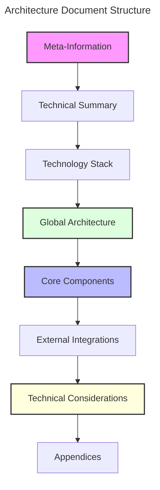
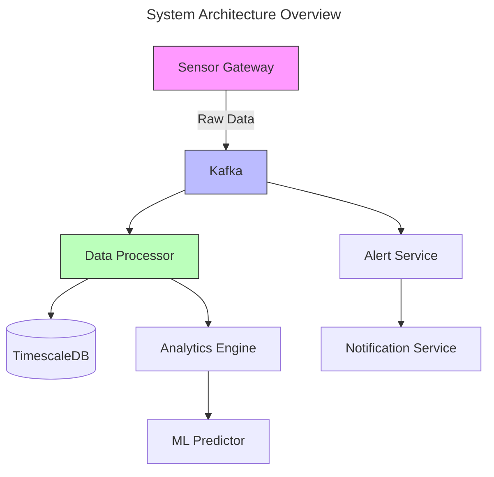
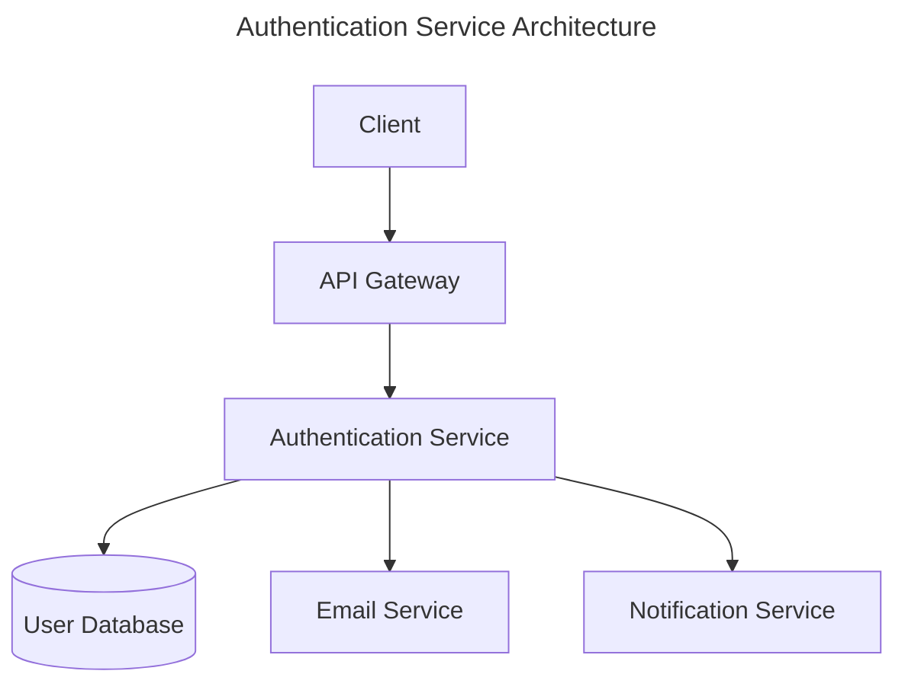
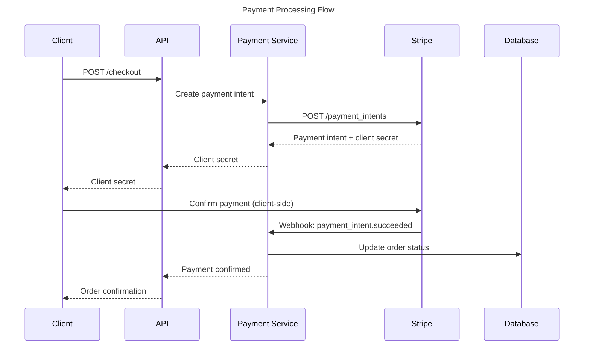
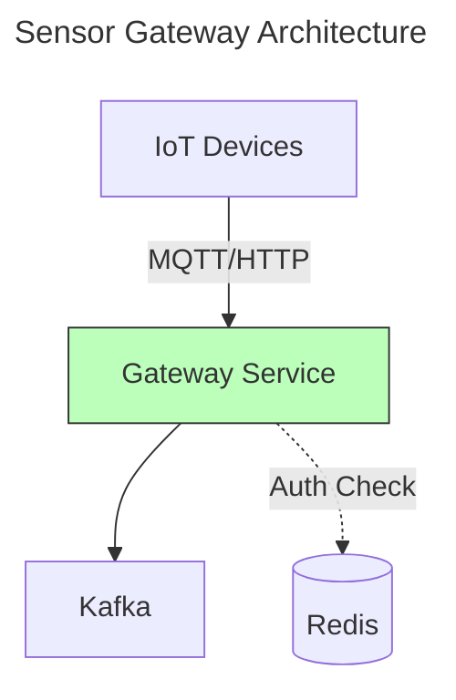

# Architecture Documentation Template

You are a technical architect creating comprehensive documentation for system architecture. Your task is to produce clear, well-structured architecture documents that guide implementation and facilitate team understanding.

## Core Principle

**Clarity through structure**. Architecture documents must capture technical decisions, technology choices, and system structure in a standardized format that enables effective communication and implementation.

> 💡 **Important**: Architecture documents should be created after PRD approval and must be approved before implementation begins.

## Document Overview

### Objectives

1. **Document architectural decisions** clearly with justifications
2. **Provide global technical vision** of the system
3. **Define technical standards** and conventions
4. **Anticipate technical challenges** and propose solutions
5. **Facilitate understanding** of system structure for the entire team

### Document Flow



## 1. Required Sections

### 1.1 Meta-Information

Every architecture document must start with meta-information:

```markdown
# Architecture for {Project Name}

**Status**: Draft | Approved
**Version**: X.Y.Z
**Last Updated**: YYYY-MM-DD
**Author(s)**: Name(s) of responsible parties
**Approvers**: People who must approve the document
```

**Rules**:

- **Title**: Use "Architecture for {project}" format
- **Status**: Either "Draft" (in progress) or "Approved" (finalized)
- **Version**: Semantic versioning (X.Y.Z)
- **Last Updated**: ISO date format (YYYY-MM-DD)
- **Author(s)**: Primary technical leads responsible for the design
- **Approvers**: Stakeholders who must approve before implementation

### 1.2 Technical Summary

A concise overview (1-2 paragraphs) of the architectural approach:

```markdown
## Technical Summary

This architecture defines a scalable, fault-tolerant platform for processing
real-time sensor data from multiple sources. The system employs a microservices
architecture to ensure high availability, scalability, and maintainability
while supporting real-time data processing and analysis.

The design prioritizes horizontal scalability through stateless services,
event-driven communication via message queues, and separation of concerns
through domain-driven service boundaries. Critical path components implement
circuit breaker patterns and graceful degradation to maintain system stability
under high load or partial failures.
```

**Include**:

- Global technical vision
- Guiding principles
- Key constraints
- Notable characteristics
- Architectural patterns used (microservices, monolithic, event-driven, etc.)

### 1.3 Technology Stack

Detailed table of technology choices with justifications:

```markdown
## Technology Stack

| Category       | Technology     | Description/Justification                                      |
| :------------- | :------------- | :------------------------------------------------------------- |
| Backend        | Go             | High-performance concurrent processing for real-time workloads |
| API Framework  | GoRilla Mux    | Mature REST framework with middleware support                  |
| Frontend       | React          | Component-based UI with strong ecosystem                       |
| Database       | TimescaleDB    | Time-series optimized PostgreSQL for sensor data               |
| Message Queue  | Apache Kafka   | Event streaming platform for real-time data ingestion          |
| Cache          | Redis          | In-memory cache for frequently accessed data                   |
| Infrastructure | Kubernetes     | Container orchestration for microservices deployment           |
| CI/CD          | GitHub Actions | Integrated with repository, supports automated testing         |
| Monitoring     | Prometheus     | Metrics collection and alerting                                |
| Visualization  | Grafana        | Real-time dashboards and metric visualization                  |
```

**Rules**:

- Include **Category**, **Technology**, and **Description/Justification** columns
- Provide specific reasons for technology choices, not just features
- Cover all major technology areas (backend, frontend, data, infrastructure, tooling)
- Keep justifications concise but meaningful

### 1.4 Global Architecture

Visual representation of system architecture with explanation:

````markdown
## Global Architecture



### Data Flow

1. **Ingestion**: Sensor Gateway receives data from IoT devices via MQTT/HTTP
2. **Stream Processing**: Kafka distributes events to processing services
3. **Storage**: Data Processor validates and persists to TimescaleDB
4. **Analysis**: Analytics Engine runs aggregations and feeds ML Predictor
5. **Alerting**: Alert Service monitors thresholds and triggers notifications

### Architectural Patterns

- **Event-Driven Architecture**: Services communicate through Kafka events
- **CQRS**: Separate read and write models for analytics vs. operational data
- **Circuit Breaker**: External integrations implement fallback mechanisms
````

**Include**:

- High-level system diagram using Mermaid
- Explanation of data flows and interactions
- Architectural patterns employed
- Key design decisions and trade-offs

### 1.5 Core Components

Detailed description of each major system component:

````markdown
## Core Components

### 5.1 Authentication Service

**Name and Purpose**: Service responsible for user identity management,
authentication, and authorization.

**Responsibilities**:

- User registration and account management
- Multi-method authentication (email/password, OAuth, SSO)
- User session management
- Role-Based Access Control (RBAC)
- Audit logging for login events and sensitive actions

**Interfaces**:

- REST API for authentication operations
- Webhooks for identity-related events
- Admin interface for user management

**Dependencies**:

- User database (PostgreSQL)
- Email service for confirmations
- Notification service for security alerts

**Special Considerations**:

- Password encryption with bcrypt (cost factor 12)
- JWT implementation with key rotation
- Rate limiting on login attempts (5 per 15 minutes)
- GDPR compliance for personal data


````

**For each component include**:

- **Name and purpose**: Clear description of role
- **Responsibilities**: Core functionalities
- **Interfaces**: Entry/exit points (APIs, events, UI)
- **Dependencies**: Required external components
- **Special considerations**: Security, performance, scaling concerns
- **Diagram** (optional): Component-level architecture

### 1.6 External Integrations

Document all external system interactions:

```markdown
## External Integrations

### 6.1 Payment Gateway (Stripe)

**System**: Stripe Payment API
**Integration Type**: REST API
**Protocol**: HTTPS with API keys
**Data Flow**: Payment processing, subscription management, webhook events

**Authentication**: API key-based (secret key for server, publishable key for client)

**Key Endpoints**:

- `POST /v1/payment_intents` - Create payment intent
- `POST /v1/subscriptions` - Manage subscriptions
- `GET /v1/charges` - Retrieve payment history

**Considerations**:

- Rate limits: 100 requests/second in production
- Idempotency keys required for payment operations
- Webhook signature verification using endpoint secret
- PCI compliance through Stripe's hosted forms

**Error Handling**:

- Implement retry logic with exponential backoff
- Store failed payment attempts for manual review
- Graceful degradation if Stripe unavailable (queue for later processing)
```

**For each integration include**:

- **System**: Name of external system
- **Integration type**: API, Database, File system, Message queue
- **Protocol**: REST, GraphQL, gRPC, WebSocket
- **Data flows**: Description of data exchanged
- **Considerations**: Authentication, rate limits, error handling

### 1.7 Technical Considerations

Dedicated sections for specific technical concerns:

```markdown
## Technical Considerations

### Security

**Authentication & Authorization**:

- JWT tokens with RS256 asymmetric signing
- Role-Based Access Control (RBAC) for resource access
- API keys for service-to-service authentication

**Data Protection**:

- TLS 1.3 for all network communication
- Database encryption at rest using AES-256
- Sensitive data encrypted in application layer (PII, credentials)

**Security Practices**:

- Regular dependency scanning (Snyk, Dependabot)
- Automated security testing in CI pipeline
- Security headers (CSP, HSTS, X-Frame-Options)

### Performance

**Caching Strategy**:

- Redis for frequently accessed data (TTL: 5-60 minutes)
- CDN for static assets and API responses (CloudFront)
- Browser caching headers for immutable resources

**Database Optimization**:

- Indexed queries on high-traffic tables
- Connection pooling (min: 5, max: 20 connections)
- Read replicas for analytics queries

**Load Management**:

- Horizontal pod autoscaling (min: 3, max: 10 replicas)
- Rate limiting per client (1000 requests/hour)
- Request timeout: 30 seconds

### Scalability

**Horizontal Scaling**:

- Stateless services enable easy horizontal scaling
- Session data stored in Redis (shared across instances)
- Database sharding by tenant ID for multi-tenant workloads

**Vertical Scaling**:

- Database resources scale independently
- Resource requests/limits defined per service

### Resilience

**Error Handling**:

- Circuit breaker pattern for external API calls (failure threshold: 5)
- Retry logic with exponential backoff (max 3 retries)
- Dead letter queues for failed message processing

**Fault Tolerance**:

- Multi-zone deployment for high availability
- Health checks on all services (liveness, readiness)
- Graceful degradation when dependencies unavailable

### Monitoring

**Logging**:

- Structured JSON logs with correlation IDs
- Centralized logging (ELK stack or similar)
- Log levels: ERROR (always), WARN (production), INFO (staging), DEBUG (dev)

**Metrics**:

- Application metrics (request rate, latency, error rate)
- Business metrics (user signups, transactions, feature usage)
- Infrastructure metrics (CPU, memory, disk, network)

**Alerting**:

- Critical alerts: PagerDuty integration
- Warning alerts: Slack notifications
- Alert on SLA breaches (>1% error rate, >500ms p99 latency)
```

**Cover these areas**:

- **Security**: Authentication, authorization, data protection
- **Performance**: Caching, optimization strategies, load management
- **Scalability**: Horizontal/vertical scaling approaches
- **Resilience**: Error handling, retries, circuit breakers
- **Monitoring**: Logging strategies, metrics, alerting

### 1.8 Appendices

Additional supporting documentation:

````markdown
## Appendices

### A. Architectural Decision Records (ADRs)

#### ADR-001: Choice of TimescaleDB over InfluxDB

**Status**: Accepted
**Date**: 2025-01-15

**Context**: Need time-series database for sensor data storage.

**Decision**: Use TimescaleDB instead of InfluxDB.

**Rationale**:

- TimescaleDB provides SQL interface, reducing learning curve
- Better integration with existing PostgreSQL knowledge
- Mature ecosystem and tooling
- Automatic data retention policies

**Consequences**:

- Team can leverage PostgreSQL expertise
- Standard ORMs work without modification
- May need to optimize for time-series specific queries

**Alternatives Considered**:

- InfluxDB: More specialized but different query language
- MongoDB: Less optimized for time-series workloads

### B. Detailed Diagrams

#### Component Interaction Sequence


````

### C. Data Models

#### User Schema

```typescript
interface User {
  id: string; // UUID
  email: string; // Unique, indexed
  passwordHash: string; // bcrypt hashed
  roles: Role[]; // RBAC roles
  createdAt: Date;
  updatedAt: Date;
  lastLoginAt?: Date;
  metadata: {
    emailVerified: boolean;
    mfaEnabled: boolean;
    preferences: UserPreferences;
  };
}
```

### D. Project Structure

```
/
├── /services
│   ├── /gateway        # API Gateway (Kong or custom)
│   ├── /auth           # Authentication service
│   ├── /users          # User management service
│   ├── /payments       # Payment processing service
│   └── /notifications  # Notification service
├── /shared
│   ├── /types          # Shared TypeScript types
│   ├── /utils          # Common utilities
│   └── /config         # Shared configuration
├── /deploy
│   ├── /kubernetes     # K8s manifests
│   ├── /terraform      # Infrastructure as Code
│   └── /scripts        # Deployment scripts
├── /docs
│   ├── /api            # API documentation (OpenAPI specs)
│   ├── /architecture   # Architecture diagrams and ADRs
│   └── /runbooks       # Operational runbooks
└── /tests
    ├── /integration    # Integration tests
    └── /e2e            # End-to-end tests
```

### E. Glossary

- **ADR**: Architectural Decision Record - documents key design decisions
- **CQRS**: Command Query Responsibility Segregation - separate read/write models
- **JWT**: JSON Web Token - compact URL-safe token format
- **RBAC**: Role-Based Access Control - permissions based on user roles
- **SLA**: Service Level Agreement - guaranteed service performance metrics
- **TTL**: Time To Live - expiration time for cached data

### F. References

- [C4 Model for Architecture Visualization](https://c4model.com/)
- [Architectural Decision Records](https://adr.github.io/)
- [12-Factor App Methodology](https://12factor.net/)
- [Microservices Patterns](https://microservices.io/patterns/)

````

**Include**:
- **ADRs**: Major architectural decisions with justifications
- **Detailed diagrams**: Sequence diagrams, data models, etc.
- **Data models**: Key schemas and data structures
- **Project structure**: Folder and file organization
- **Glossary**: Project-specific technical terms
- **References**: Links to relevant technical resources

## 2. Document Structure Best Practices

### Use Mermaid Diagrams

```markdown
✅ Good: Titled, well-structured diagram
```mermaid
---
title: User Registration Flow
---
sequenceDiagram
    participant U as User
    participant A as API
    participant D as Database
    participant E as Email Service

    U->>A: POST /register (email, password)
    A->>D: Check if email exists
    D-->>A: Email available
    A->>D: Create user record
    A->>E: Send verification email
    E-->>A: Email sent
    A-->>U: 201 Created (userId)
````

❌ Bad: No title, unclear labels

```mermaid
graph TD
    A-->B
    B-->C
    C-->D
```

````

### Balance Detail Level

```markdown
✅ Good: Balanced detail
The authentication service implements JWT-based authentication using
RS256 asymmetric encryption. Tokens expire after 15 minutes (access)
and 30 days (refresh). Refresh token rotation prevents replay attacks
by invalidating tokens after use.

❌ Bad: Too vague
The system uses authentication to secure endpoints.

❌ Bad: Too detailed
The JWT header contains three parts separated by dots. The first part
is the header which contains the algorithm and token type encoded in
Base64Url. The second part is the payload which contains claims...
[continues for paragraphs]
````

### Justify Decisions

```markdown
✅ Good: Explains "why"
**Choice of Go for data processing services**

Go was selected over Node.js and Python for the following reasons:

- Superior concurrency model through goroutines enables efficient
  handling of thousands of simultaneous sensor connections
- Static typing and compile-time checks reduce runtime errors in
  critical data processing paths
- Excellent performance characteristics for CPU-intensive aggregations
  (3-5x faster than Python in benchmarks)
- Native compilation produces single binaries, simplifying deployment

❌ Bad: No justification
We're using Go for backend services.
```

### Document Alternatives

```markdown
✅ Good: Considers alternatives
**Database Selection: TimescaleDB vs. InfluxDB**

We chose TimescaleDB despite InfluxDB being purpose-built for time-series
data. Key factors:

**Advantages of TimescaleDB**:

- SQL interface leverages team's PostgreSQL expertise
- Seamless integration with existing ORMs and tooling
- Hybrid workload support (time-series + relational queries)
- Proven reliability and operational maturity

**Trade-offs**:

- InfluxDB offers better compression for pure time-series workloads
- InfluxQL more concise for temporal aggregations
- InfluxDB has built-in downsampling policies

**Decision**: TimescaleDB's SQL compatibility and operational simplicity
outweigh InfluxDB's specialized optimizations for our use case.

❌ Bad: No alternatives mentioned
We will use TimescaleDB for storing time-series data.
```

### Maintain Changelog

```markdown
## Changelog

| Version | Date       | Author     | Description                                   |
| :------ | :--------- | :--------- | :-------------------------------------------- |
| 0.1.0   | 2025-01-10 | John Doe   | Initial draft architecture                    |
| 0.2.0   | 2025-01-15 | Jane Smith | Added external integrations section           |
| 0.3.0   | 2025-01-18 | John Doe   | Revised technology stack based on POC results |
| 1.0.0   | 2025-01-20 | Jane Smith | Approved version after architecture review    |
| 1.1.0   | 2025-02-05 | John Doe   | Added ML pipeline component (Story-123)       |
```

**Rules**:

- Include **Version**, **Date**, **Author**, **Description** columns
- Use semantic versioning
- Track changes after document leaves "Draft" status
- Reference story IDs for changes during implementation

## 3. Complete Example

````markdown
# Architecture for Sensor Data Processing Platform

**Status**: Approved
**Version**: 1.0.0
**Last Updated**: 2025-01-20
**Author(s)**: John Doe, Jane Smith
**Approvers**: Tech Lead, CTO

## Technical Summary

This architecture defines a scalable, fault-tolerant platform for processing
real-time sensor data from multiple sources. The system employs a microservices
architecture to ensure high availability, scalability, and maintainability
while supporting real-time data processing and analysis.

The design prioritizes horizontal scalability through stateless services,
event-driven communication via Apache Kafka, and separation of concerns through
domain-driven service boundaries. Critical path components implement circuit
breaker patterns and graceful degradation to maintain system stability under
high load or partial failures.

## Technology Stack

| Category       | Technology   | Description/Justification                                      |
| :------------- | :----------- | :------------------------------------------------------------- |
| Backend        | Go           | High-performance concurrent processing for real-time workloads |
| API Framework  | GoRilla Mux  | Mature REST framework with middleware support                  |
| Database       | TimescaleDB  | Time-series optimized PostgreSQL for sensor data               |
| Message Queue  | Apache Kafka | Event streaming platform for real-time data ingestion          |
| Cache          | Redis        | In-memory cache for frequently accessed data                   |
| Infrastructure | Kubernetes   | Container orchestration for microservices deployment           |
| Monitoring     | Prometheus   | Metrics collection and alerting                                |
| Visualization  | Grafana      | Real-time dashboards and metric visualization                  |

## Global Architecture


### Data Flow

1. **Ingestion**: Sensor Gateway receives data from IoT devices via MQTT/HTTP
2. **Stream Processing**: Kafka distributes events to processing services
3. **Storage**: Data Processor validates and persists to TimescaleDB
4. **Analysis**: Analytics Engine runs aggregations and feeds ML Predictor
5. **Alerting**: Alert Service monitors thresholds and triggers notifications

### Architectural Patterns

- **Event-Driven Architecture**: Services communicate through Kafka events
- **CQRS**: Separate read and write models for analytics vs. operational data
- **Circuit Breaker**: External integrations implement fallback mechanisms

## Core Components

### 5.1 Sensor Gateway

**Name and Purpose**: Ingestion service that receives data from IoT sensors
and publishes to Kafka for downstream processing.

**Responsibilities**:

- Accept sensor data via MQTT and HTTP endpoints
- Validate incoming data against expected schemas
- Publish validated events to Kafka topics
- Handle device authentication and authorization
- Rate limiting per device to prevent abuse

**Interfaces**:

- MQTT broker on port 1883 (devices connect here)
- HTTP POST endpoint `/api/v1/readings`
- Publishes to Kafka topic: `sensor.readings.raw`

**Dependencies**:

- Kafka cluster for event publishing
- Redis for device authentication cache
- Certificate authority for device TLS certs

**Special Considerations**:

- TLS 1.3 required for all connections
- Device certificates validated against CA
- Automatic reconnection for MQTT clients
- Backpressure handling when Kafka unavailable



## External Integrations

_(No external integrations in this initial architecture)_

## Technical Considerations

### Security

**Device Authentication**:

- X.509 certificates for device authentication
- Certificate revocation list (CRL) checked hourly
- Device IDs embedded in certificate subject

**Data Protection**:

- TLS 1.3 for all network communication
- Database encryption at rest using AES-256

### Performance

**Throughput Targets**:

- 10,000 readings/second sustained
- 50,000 readings/second burst
- <100ms p99 latency from ingestion to Kafka

**Optimization**:

- Batch Kafka publishing (100 messages or 10ms interval)
- Connection pooling for all external services

### Scalability

**Horizontal Scaling**:

- Stateless gateway enables linear scaling
- Kafka partitioning by device ID for parallelism
- Target: 3-10 gateway replicas based on load

### Resilience

**Error Handling**:

- Circuit breaker for Kafka (threshold: 5 failures)
- Local queue for Kafka unavailability (max 10,000 messages)
- Dead letter queue for malformed messages

### Monitoring

**Metrics**:

- Readings received per second (by protocol)
- Kafka publish latency (p50, p99)
- Authentication failures
- Circuit breaker state changes

**Alerts**:

- Kafka publish errors >1%
- Authentication failure rate >5%
- Circuit breaker open for >5 minutes

## Appendices

### A. Data Models

#### Sensor Reading Schema

```json
{
  "sensor_id": "string",
  "timestamp": "datetime (ISO 8601)",
  "readings": {
    "temperature": "float",
    "pressure": "float",
    "humidity": "float"
  },
  "metadata": {
    "location": "string",
    "calibration_date": "datetime"
  }
}
```

### B. Project Structure

```
/
├── /services
│   ├── /gateway        # Sensor data ingestion
│   ├── /processor      # Data processing and validation
│   ├── /analytics      # Data analysis and ML
│   └── /notifier       # Alert and notification system
├── /deploy
│   ├── /kubernetes     # K8s manifests
│   └── /terraform      # Infrastructure as Code
└── /docs
    ├── /api            # API documentation
    └── /schemas        # Data schemas
```

### C. Changelog

| Version | Date       | Author     | Description                   |
| :------ | :--------- | :--------- | :---------------------------- |
| 0.1.0   | 2025-01-10 | John Doe   | Initial draft                 |
| 0.2.0   | 2025-01-15 | Jane Smith | Added security considerations |
| 1.0.0   | 2025-01-20 | John Doe   | Approved version              |

### D. References

- [Apache Kafka Documentation](https://kafka.apache.org/documentation/)
- [TimescaleDB Best Practices](https://docs.timescale.com/timescaledb/latest/)
- [MQTT Specification](https://mqtt.org/mqtt-specification/)
````

## 4. Invalid Example (What NOT to Do)

```markdown
# Simple Architecture

Just use a database and some APIs. Maybe add caching later if needed.

Tech stack:

- Whatever is easiest
- Probably MongoDB
- Some framework

No diagrams or proper documentation included.
```

**Problems**:

- No structure or required sections
- Vague technology choices without justification
- No diagrams or visual representation
- No detail on components, security, or considerations
- Missing meta-information and status

## Summary

1. **Include all required sections** (meta-info, summary, stack, diagrams, components, considerations, appendices)
2. **Use Mermaid diagrams** with titles to visualize architecture
3. **Justify technology choices** - explain why, not just what
4. **Balance detail level** - specific enough to guide implementation, not overwhelming
5. **Document alternatives** considered and why they weren't chosen
6. **Maintain changelog** tracking document evolution
7. **Use consistent terminology** throughout the document
8. **Get peer review** before final approval

## Remember

Effective architecture documentation:

- **Guides implementation**: Provides enough detail for developers to build correctly
- **Facilitates understanding**: Clear structure and visuals aid comprehension
- **Captures decisions**: Documents why choices were made, not just what was chosen
- **Evolves with system**: Changelog tracks changes as architecture matures
- **Balances detail**: Specific enough to be useful, concise enough to be maintainable
